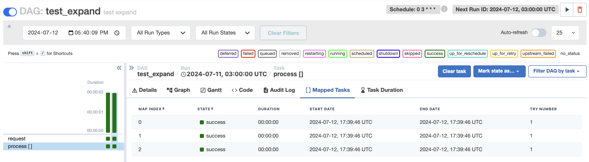
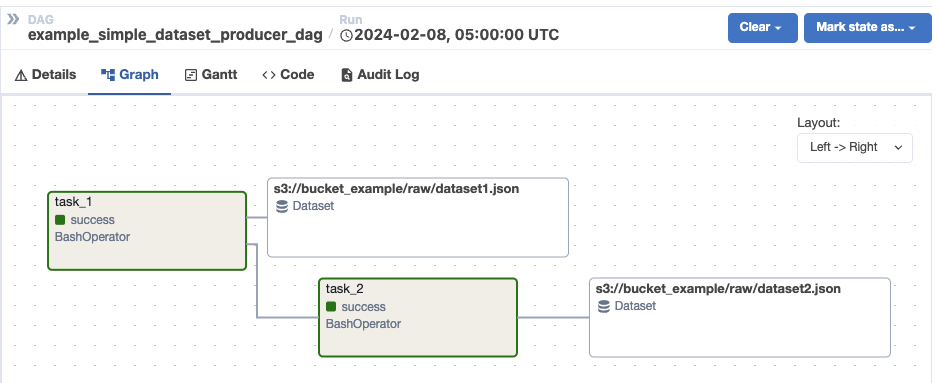
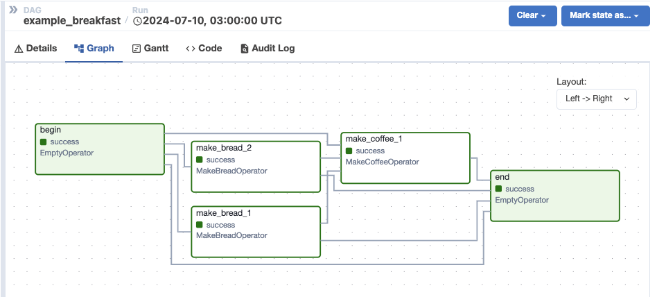

# dag-factory

[](https://github.com/astronomer/dag-factory/actions?workflow=build)
[](https://codecov.io/github/astronomer/dag-factory?branch=master)
[](https://pypi.org/project/dag-factory/)
[](https://github.com/ambv/black)
[](https://img.shields.io/pypi/dm/dag-factory)


Welcome to *dag-factory*! *dag-factory* is a library for [Apache Airflow®](https://airflow.apache.org) to construct DAGs
declaratively via configuration files.

The minimum requirements for **dag-factory** are:

- Python 3.8.0+
- [Apache Airflow®](https://airflow.apache.org) 2.0+

For a gentle introduction, please take a look at our [Quickstart Guide](#quickstart). For more examples, please see the
[examples](/examples) folder.

- [Quickstart](#quickstart)
- [Features](#features)
  - [Multiple Configuration Files](#multiple-configuration-files)
  - [Dynamically Mapped Tasks](#dynamically-mapped-tasks)
  - [Datasets](#datasets)
  - [Custom Operators](#custom-operators)
- [Benefits](#benefits)
- [Notes](#notes)
  - [HttpSensor (since 1.0.0)](#httpsensor-since-100)
- [Contributing](#contributing)

## Quickstart

The following example demonstrates how to create a simple DAG using *dag-factory*. We will be generating a DAG with three tasks, where `task_2` and `task_3` depend on `task_1`.
These tasks will be leveraging the `BashOperator` to execute simple bash commands.


(1) To install *dag-factory*, run the following pip command in your [Apache Airflow®](https://airflow.apache.org) environment:

```bash
pip install dag-factory
```

(2) Create a YAML configuration file called `config_file.yml` and save it within your dags folder:

```yaml
example_dag1:
  default_args:
    owner: 'example_owner'
    retries: 1
    start_date: '2024-01-01'
  schedule_interval: '0 3 * * *'
  catchup: False
  description: 'this is an example dag!'
  tasks:
    task_1:
      operator: airflow.operators.bash_operator.BashOperator
      bash_command: 'echo 1'
    task_2:
      operator: airflow.operators.bash_operator.BashOperator
      bash_command: 'echo 2'
      dependencies: [task_1]
    task_3:
      operator: airflow.operators.bash_operator.BashOperator
      bash_command: 'echo 3'
      dependencies: [task_1]
```

We are setting the execution order of the tasks by specifying the `dependencies` key.

(3) In the same folder, create a python file called `generate_dags.py`. This file is responsible for generating the DAGs from the configuration file and is a one-time setup.
You won't need to modify this file unless you want to add more configuration files or change the configuration file name.

```python
from airflow import DAG  ## by default, this is needed for the dagbag to parse this file
import dagfactory
from pathlib import Path

config_file = Path.cwd() / "dags/config_file.yml"
dag_factory = dagfactory.DagFactory(config_file)

dag_factory.clean_dags(globals())
dag_factory.generate_dags(globals())
```

After a few moments, the DAG will be generated and ready to run in Airflow. Unpause the DAG in the [Apache Airflow®](https://airflow.apache.org) UI and watch the tasks execute!


Please look at the [examples](/examples) folder for more examples.

## Features

### Multiple Configuration Files

If you want to split your DAG configuration into multiple files, you can do so by leveraging a suffix in the configuration file name.

```python
    from dagfactory import load_yaml_dags  # load relevant YAML files as airflow DAGs

    load_yaml_dags(globals_dict=globals(), suffix=['dag.yaml'])
```

### Dynamically Mapped Tasks

If you want to create a dynamic number of tasks, you can use the `mapped_tasks` key in the configuration file. The `mapped_tasks` key is a list of dictionaries, where each dictionary represents a task.

```yaml
...
  tasks:
    request:
      operator: airflow.operators.python.PythonOperator
      python_callable_name: example_task_mapping
      python_callable_file: /usr/local/airflow/dags/expand_tasks.py # this file should contain the python callable
    process:
      operator: airflow.operators.python_operator.PythonOperator
      python_callable_name: expand_task
      python_callable_file: /usr/local/airflow/dags/expand_tasks.py
      partial:
        op_kwargs:
          test_id: "test"
      expand:
        op_args:
          request.output
      dependencies: [request]
```



### Datasets

**dag-factory** supports scheduling DAGs via [Apache Airflow Datasets](https://airflow.apache.org/docs/apache-airflow/stable/authoring-and-scheduling/datasets.html).

To leverage, you need to specify the `Dataset` in the `outlets` key in the configuration file. The `outlets` key is a list of strings that represent the dataset locations.
In the `schedule` key of the consumer dag, you can set the `Dataset` you would like to schedule against. The key is a list of strings that represent the dataset locations.
The consumer dag will run when all the datasets are available.

```yaml
producer_dag:
  default_args:
    owner: "example_owner"
    retries: 1
    start_date: '2024-01-01'
  description: "Example DAG producer simple datasets"
  schedule_interval: "0 5 * * *"
  tasks:
    task_1:
      operator: airflow.operators.bash_operator.BashOperator
      bash_command: "echo 1"
      outlets: [ 's3://bucket_example/raw/dataset1.json' ]
    task_2:
      bash_command: "echo 2"
      dependencies: [ task_1 ]
      outlets: [ 's3://bucket_example/raw/dataset2.json' ]
consumer_dag:
  default_args:
    owner: "example_owner"
    retries: 1
    start_date: '2024-01-01'
  description: "Example DAG consumer simple datasets"
  schedule: [ 's3://bucket_example/raw/dataset1.json', 's3://bucket_example/raw/dataset2.json' ]
  tasks:
    task_1:
      operator: airflow.operators.bash_operator.BashOperator
      bash_command: "echo 'consumer datasets'"
```



### Custom Operators

**dag-factory** supports using custom operators. To leverage, set the path to the custom operator within the `operator` key in the configuration file. You can add any additional parameters that the custom operator requires.

```yaml
...
  tasks:
    begin:
      operator: airflow.operators.dummy_operator.DummyOperator
    make_bread_1:
      operator: customized.operators.breakfast_operators.MakeBreadOperator
      bread_type: 'Sourdough'
```



### Callbacks

**dag-factory** also supports using "callbacks" at the DAG, Task, and TaskGroup level. These callbacks can be defined in
a few different ways. The first points directly to a Python function that has been defined in the `include/callbacks.py`
file.

```yaml
example_dag1:
  on_failure_callback: include.callbacks.example_callback1
...
```

Here, the `on_success_callback` points to first a file, and then to a function name within that file. Notice that this
callback is defined using `default_args`, meaning this callback will be applied to all tasks.

```yaml
example_dag1:
  ...
  default_args:
    on_success_callback_file: /usr/local/airflow/include/callbacks.py
    on_success_callback_name: example_callback1
```

**dag-factory** users can also leverage provider-built tools when configuring callbacks. In this example, the
`send_slack_notification` function from the Slack provider is used to dispatch a message when a DAG failure occurs. This
function is passed to the `callback` key under `on_failure_callback`. This pattern allows for callback definitions to
take parameters (such as `text`, `channel`, and `username`, as shown here).

**Note that this functionality is currently only supported for `on_failure_callback`'s defined at the DAG-level, or in
`default_args`. Support for other callback types and Task/TaskGroup-level definitions are coming soon.**

```yaml
example_dag1:
  on_failure_callback:
    callback: airflow.providers.slack.notifications.slack.send_slack_notification
    slack_conn_id: example_slack_id
    text: |
      :red_circle: Task Failed.
      This task has failed and needs to be addressed.
      Please remediate this issue ASAP.
    channel: analytics-alerts
    username: Airflow
...
```

## Notes

### HttpSensor (since 1.0.0)

The package `airflow.providers.http.sensors.http` is available for Airflow 2.0+

The following example shows `response_check` logic in a python file:

```yaml
task_2:
  operator: airflow.providers.http.sensors.http.HttpSensor
  http_conn_id: 'test-http'
  method: 'GET'
  response_check_name: check_sensor
  response_check_file: /path/to/example1/http_conn.py
  dependencies: [task_1]
```

The `response_check` logic can also be provided as a lambda:

```yaml
task_2:
  operator: airflow.providers.http.sensors.http.HttpSensor
  http_conn_id: 'test-http'
  method: 'GET'
  response_check_lambda: 'lambda response: "ok" in response.text'
  dependencies: [task_1]
```

## Benefits

- Construct DAGs without knowing Python
- Construct DAGs without learning Airflow primitives
- Avoid duplicative code
- Everyone loves YAML! ;)

## Contributing

Contributions are welcome! Just submit a Pull Request or Github Issue.

## License

To learn more about the terms and conditions for use, reproduction and distribution, read the [Apache License 2.0](https://github.com/astronomer/dag-factory/blob/main/LICENSE).

## Privacy Notice

This project follows [Astronomer's Privacy Policy](https://www.astronomer.io/privacy/).

For further information, [read this](https://github.com/astronomer/dag-factory/blob/main/PRIVACY_NOTICE.md)

## Security Policy

Check the project's [Security Policy](https://github.com/astronomer/dag-factory/blob/main/SECURITY.md) to learn
how to report security vulnerabilities in DAG Factory and how security issues reported to the DAG Factory
security team are handled.
