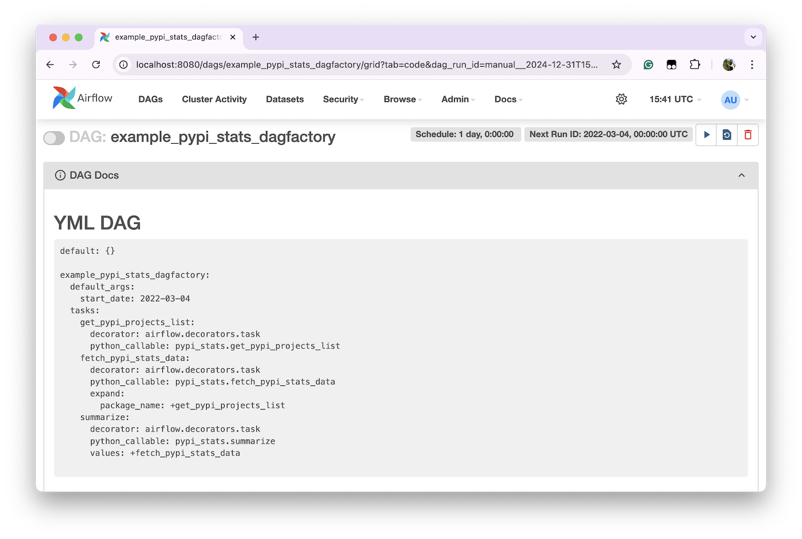

# TaskFlow API: Using YAML instead of Python

For users that employ lots of Python functions in their DAGs, [TaskFlow API](https://www.astronomer.io/docs/learn/airflow-decorators/) represent a simpler way to transform functions into tasks, with a more intuitive way of passing data between them.
They were  introduced in Airflow 2 as an alternative to Airflow [traditional operators](traditional_operators.md).

The following section shows how to represent an Airflow DAG using TaskFlow API and how to define the same DAG using
DAG Factory. Ultimately, both implementations use the same Airflow operators. The main difference is the language used
to declare the workflow: one uses Python and the other uses YAML.

## Goal

Let's say we'd like to create a workflow that performs the following:

1. Create a list of [PyPI](https://pypi.org/) projects to be analysed.
2. Fetch the [statistics](https://pypistats.org/) for each of these projects.
3. Summarize the selected statistics as Markdown, using Python.

We will implement all these steps using the Airflow `task` decorator, and the last task will generate a Markdown table similar to:

```text
| package_name      |   last_day |   last_month |   last_week |
|:------------------|-----------:|-------------:|------------:|
| apache-airflow    |     852242 |     28194255 |     6253861 |
| astronomer-cosmos |     442531 |     13354870 |     3127750 |
| dag-factory       |      10078 |       354085 |       77752 |
```

The main logic is implemented as plain Python functions in [pypi_stats.py](https://github.com/astronomer/dag-factory/blob/main/dev/dags/pypi_stats.py):

```title="pypi_stats.py"
--8<-- "dev/dags/pypi_stats.py:pypi_stats"
```

## Implementation

As a reference, the following workflows run using Airflow 2.10.2 and DAG Factory 0.21.0.

### Plain Airflow Python DAG

```title="example_pypi_stats_plain_airflow.py"
--8<-- "dev/dags/comparison/example_pypi_stats_plain_airflow.py"
```

### Alternative DAG Factory YAML

```title="example_pypi_stats_dagfactory.yml"
--8<-- "dev/dags/comparison/example_pypi_stats_dagfactory.yml"
```

## Comparison

### Goal

Both implementations accomplish the same goal and result in the expected Markdown table.

### Airflow Graph view

As shown in the screenshots below, both the DAG created using Python with standard Airflow and the
DAG created using YAML and DAG Factory look identical, from a graph topology perspective, and also from the underlining operators being used.

#### Graph view: Plain Airflow Python DAG


#### Graph view: Alternative DAG Factory YAML


### Airflow Dynamic Task Mapping

In both workflows, we are dynamically generating a task for each PyPI repo.

#### Mapped Tasks: Plain Airflow Python DAG


#### Mapped Tasks: Alternative DAG Factory YAML


### Airflow Code view

From an Airflow UI perspective, the content displayed in the "Code" view is the main difference between the two implementations. While Airflow renders the original Python DAG, as expected, in the case of the YAML DAGs, Airflow displays the Python file that references the DAG Factory YAML files:

```title="example_load_yaml_dags.py"
--8<-- "dev/dags/example_load_yaml_dags.py"
```

#### Code view: Plain Airflow Python DAG


#### Code view: Alternative DAG Factory YAML


To overcome this limitation, DAG Factory appends the YAML content to the DAG Documentation so users can better troubleshoot the DAG:


