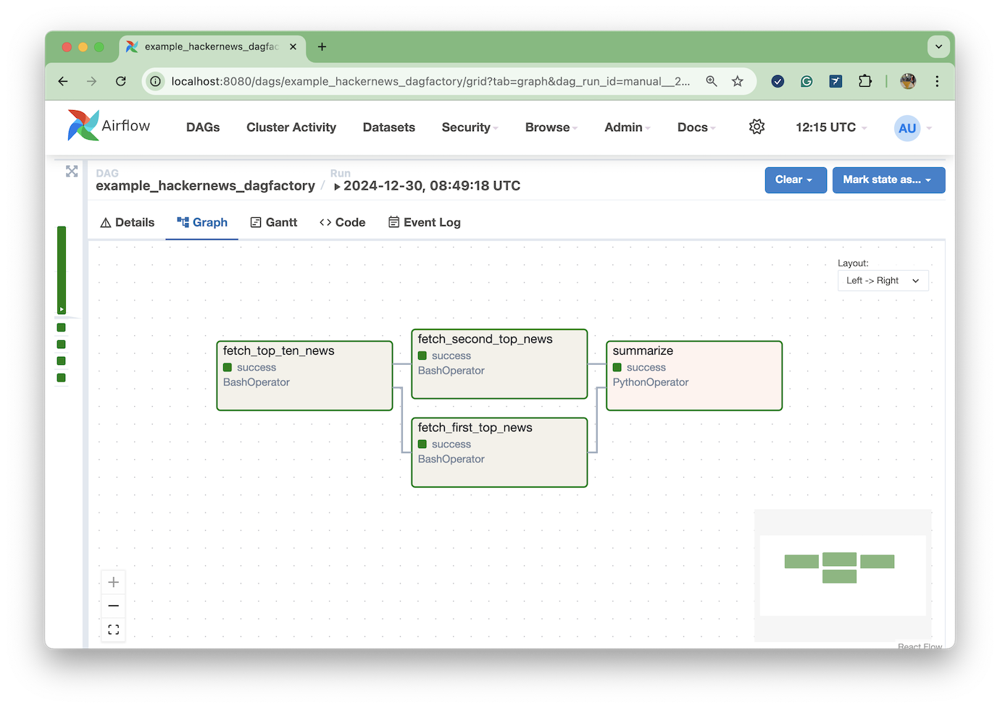

# Traditional Operators: Using YAML instead of Python

Traditionally, operators are Airflow's building blocks, and while they are robust and diverse,
they can sometimes lead to boilerplate-heavy DAGs compared to the newer [TaskFlow API](./taskflow_api.md).

Most of the Airflow providers come with built-in traditional operators. Some examples include `BashOperator`, `PythonOperator`, `KubernetesPodOperator`, and  `PostgresOperator`.

Below, we illustrate how to represent an Airflow DAG using traditional operators and how to define the same DAG using
DAG Factory. Ultimately, both implementations use the same Airflow operators. The main difference is the language used
to declare the workflow: while one uses Python, the other uses YAML.


## Goal

Let's say we'd like to create a workflow that performs the following:

1. Retrieve the top ten stories from Hacker News using the [Hacker News API](https://github.com/HackerNews/API).
2. Fetch the details for the two top stories using the Hacker News API.
3. Summarize the selected stories Markdown, using Python.

We will implement the first two steps using `BashOperator` and the third step using `PythonOperator`.

The last task of the workflow will use the method `summarize` defined in [hackernews.py](../../dev/dags/hackernews.py) to generate a `Markdown` like the one below:

```
| title                                                                       | url                                                                                                                    |
|:----------------------------------------------------------------------------|:-----------------------------------------------------------------------------------------------------------------------|
| I keep turning my Google Sheets into phone-friendly webapps                 | https://arstechnica.com/gadgets/2024/12/making-tiny-no-code-webapps-out-of-spreadsheets-is-a-weirdly-fulfilling-hobby/ |
| Coconut by Meta AI – Better LLM Reasoning with Chain of Continuous Thought? | https://aipapersacademy.com/chain-of-continuous-thought/                                                               |
```

## Implementation

As a reference, the following workflows run using Airflow 2.10.2 and DAG Factory 0.21.0.

### Plain Airflow Python DAG

```title="example_hackernews_plain_airflow.py"
--8<-- "dev/dags/comparison/example_hackernews_plain_airflow.py"
```

### Alternative DAG Factory YAML

```title="example_hackernews_plain_airflow.py"
--8<-- "dev/dags/comparison/example_hackernews_dagfactory.yml"
```


## Comparison

### Goal

Both implementations accomplish the same goal and result in the expected Markdown table.

### Airflow Graph view

As it can be seen in the screenshots below, both the DAG created using Python with standard Airflow and the
DAG created using YAML and DAG Factory look identical, from a graph topology perspective, and also from the underlining
operators being used.

#### Graph view: Plain Airflow Python DAG


#### Graph view: Alternative DAG Factory YAML



### Airflow Code view

From an Airflow UI perspective, the content displayed in the "Code" view is the main difference between the two implementations. While Airflow renders the original Python DAG, as expected, in the case of the YAML DAGs, Airflow displays the Python file that references the DAG Factory YAML files:

```title="example_load_yaml_dags.py"
--8<-- "dev/dags/example_load_yaml_dags.py"
```

#### Code view: Plain Airflow Python DAG


#### Code view: Alternative DAG Factory YAML


To overcome this limitation, DAG Factory appends the YAML content to the DAG Documentation so users can better troubleshoot
the DAG:


