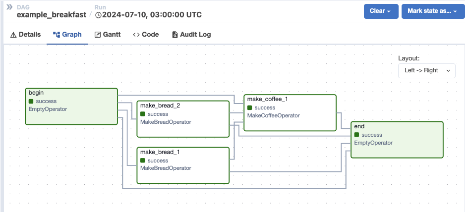

# Custom Operators

**DAG-Factory** supports [custom operators](https://airflow.apache.org/docs/apache-airflow/stable/howto/custom-operator.html). To leverage, set the path to the custom operator within the `operator` key in the configuration file. You can add any additional parameters that the custom operator requires.

```yaml
...
  tasks:
    - task_id: begin
      operator: airflow.operators.empty.EmptyOperator
    - task_id: make_bread_1
      operator: customized.operators.breakfast_operators.MakeBreadOperator
      bread_type: 'Sourdough'
```


