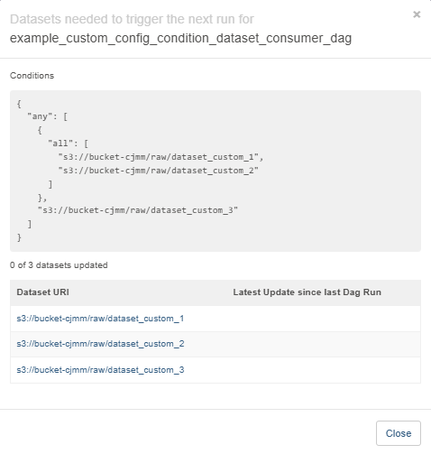

# Datasets
DAG Factory supports Airflow’s [Datasets](https://airflow.apache.org/docs/apache-airflow/stable/authoring-and-scheduling/datasets.html).

## Datasets Outlets

To leverage, you need to specify the `Dataset` in the `outlets` key in the configuration file. The `outlets` key is a list of strings that represent the dataset locations.
In the `schedule` key of the consumer dag, you can set the `Dataset` you would like to schedule against. The key is a list of strings that represent the dataset locations.
The consumer dag will run when all the datasets are available.

#### Example: Outlet

```title="example_dag_datasets_outlet.yml"
--8<-- "dev/dags/datasets/example_dag_datasets_outlet.yml"
```


## Conditional Dataset Scheduling

#### Minimum Requirements:
* dag-factory 0.22.0+
* [Apache Airflow® 2.9+](https://www.astronomer.io/docs/learn/airflow-datasets/#conditional-dataset-scheduling)


#### Logical operators for datasets
Airflow supports two logical operators for combining dataset conditions:

* AND (``&``): Specifies that the DAG should be triggered only after all of the specified datasets have been updated.
* OR (``|``): Specifies that the DAG should be triggered when any of the specified datasets is updated.

These operators enable you to configure your Airflow workflows to use more complex dataset update conditions, making them more dynamic and flexible.

#### Examples of Conditional Dataset Scheduling

Below are examples demonstrating how to configure a consumer DAG using conditional dataset scheduling.

##### Example 1: String Condition

```title="example_dataset_condition_string.yml"
--8<-- "dev/dags/datasets/example_dataset_condition_string.yml"
```

##### Example 2: YAML Syntax

```title="example_dataset_yaml_syntax.yml"
--8<-- "dev/dags/datasets/example_dataset_yaml_syntax.yml"
```

---

#### Visualization

The following diagrams illustrate the dataset conditions described in the example configurations:

1. **`s3://bucket-cjmm/raw/dataset_custom_1`** and **`s3://bucket-cjmm/raw/dataset_custom_2`** must both be updated for the first condition to be satisfied.
2. Alternatively, **`s3://bucket-cjmm/raw/dataset_custom_3`** alone can satisfy the condition.


