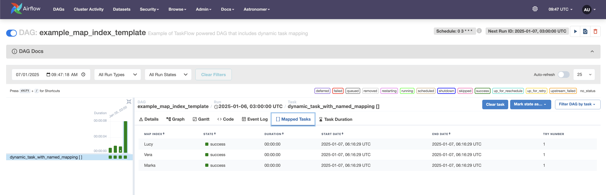

# Dynamic tasks

DAG Factory supports Airflow’s
[Dynamic Task Mapping](https://airflow.apache.org/docs/apache-airflow/stable/authoring-and-scheduling/dynamic-task-mapping.html),
enabling workflows to dynamically create tasks at runtime.  This approach allows the number of tasks to be determined
during execution, usually based on the outcome of a preceding task, rather than being predefined during DAG authoring.

## Example: Defining Dynamic Tasks

Below is an example configuration for implementing dynamic tasks using DAG Factory:

```title="example_dynamic_task_mapping.yml"
--8<-- "dev/dags/example_dynamic_task_mapping.yml"
```

### Explanation of the Configuration

1. `request` Task:
    - Generates a list of items using the `make_list` function from the [expand_tasks.py](https://github.com/astronomer/dag-factory/blob/main/dev/dags/expand_tasks.py) module.
    - This task serves as the input provider for the dynamically mapped tasks.

2. `process` Task:
    - Dynamically generates one task for each item in the list produced by the `request` task.
    - The expand argument is used to create these tasks at runtime, with `request.output` supplying the input list.
    - Additionally, the `partial` argument is used to specify fixed parameters (`op_kwargs`) that are applied to all dynamically generated tasks.

### How It Works

- Dynamic Task Creation:
    The `expand` keyword allows the process task to spawn multiple tasks at runtime, each processing a single item from
the list output of the `request` task.

- Fixed Parameters:
    The partial keyword ensures that common parameters, such as `fixed_param`, are passed to every dynamically created
task instance.

### Benefits of Dynamic Task Mapping with DAG Factory

- Flexibility: Handle varying input sizes and conditions dynamically without modifying the DAG definition.
- Scalability: Efficiently process large datasets by leveraging Airflow’s parallel execution capabilities.
- Simplicity: Define dynamic workflows declaratively using YAML, minimizing boilerplate code.

### Airflow mapped tasks view

Below you can see list of mapped tasks generated dynamically as part of the `process` task


## Advanced Dynamic Task Mapping with DAG Factory

Below, we explain the different methods for defining dynamic task mapping, illustrated by the provided example configuration.

```title="Dynamic Task Mapping advanced usage"
--8<-- "dev/dags/example_taskflow.yml"
```

The above example illustrates below advanced usage of Dynamic Task Mapping using Dag Factory (the callable functions
used in the example are kept in [sample.py](https://github.com/astronomer/dag-factory/blob/main/dev/dags/sample.py)):

1. **Static Input Mapping**

    The task `double_number_with_dynamic_task_mapping_static` shows how dynamic tasks can be created using static lists
as input. With this three tasks will be created, each processing one number.

2. **Task-Generated Input Mapping**

    The task `double_number_with_dynamic_task_mapping_taskflow` shows how tasks can use outputs from other tasks as
input for dynamic task mapping. The prefix `+` tells Dag Factory to resolve this value as the task `numbers_list`,
previously defined.

3. **Mapping with Multiple Inputs**

    The task `multiply_with_multiple_parameters` shows how dynamic task mapping can combine outputs from multiple tasks
as input parameters.

## Named Mapping in Dynamic Tasks with DAG Factory

Starting with Airflow 2.9, the `map_index_template` feature allows for custom mapping name for dynamic tasks based on a
user-defined key. DAG Factory fully supports this feature, enabling users to name tasks dynamically in a meaningful way
during runtime. This can be useful for tracing and debugging tasks.

Below is an example of how to configure and use custom names for mapped tasks

```title="example_map_index_template.yml"
--8<-- "dev/dags/example_map_index_template.yml"
```

### How it works

1. map_index_template:
   Customizes the naming of dynamically mapped tasks using a Jinja2 expression. In this example, it uses
`custom_mapping_key` from the task context to define task names.
2. expand:
   Dynamically generates tasks for each entry in the `full_name` list
     - Lucy Black
     - Vera Santos
     - Marks Spencer
3. Dynamic Task Naming:
   The `custom_mapping_key` is set to the first name of each person, e.g., Lucy, Vera, and Marks using the callable
function `extract_last_name` is kept in [sample.py](https://github.com/astronomer/dag-factory/blob/main/dev/dags/sample.py)

### Airflow named mapped tasks view

The below image shows that the `map_index` gets the first name of the person in the mapped tasks with the above configuration


