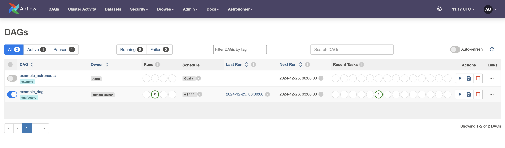

# DAG Factory

**DAG Factory** is a library for [Apache Airflow®](https://airflow.apache.org) that allows you to construct DAGs declaratively via configuration files.

# Prerequisites

The minimum requirements for **dag-factory** are:

- Python 3.8.0+
- [Apache Airflow®](https://airflow.apache.org) 2.0+


> **Note:** We will use the [astro-cli](https://www.astronomer.io/docs/astro/cli/overview) tool to set up the Airflow environment.


# Initialize Apache Airflow Project

To initialize your [Apache Airflow®](https://airflow.apache.org) project using astro-cli, follow these steps:

```commandline
mkdir dag-factory-quick-start && cd dag-factory-quick-start

astro dev init
```

This command will create the necessary Apache [Apache Airflow®](https://airflow.apache.org) project structure. After running it, the directory structure should look like the one below:


# Install DAG Factory

To install DAG Factory in your Airflow environment

1. Add ``dag-factory`` as a dependency to the ``requirements.txt`` file created during the project initialization.


# Example DAG

**DAG Factory** uses YAML files to define DAG configurations. Create a file named ``example_dag_factory.yml`` in the ``dags`` folder with the following configuration:

```yaml
default:
  default_args:
    catchup: false,
    start_date: 2024-11-11

example_dag:
  default_args:
    owner: "custom_owner"
  description: "this is an example dag"
  schedule_interval: "0 3 * * *"
  render_template_as_native_obj: True
  tasks:
    task_1:
      operator: airflow.operators.bash_operator.BashOperator
      bash_command: "echo 1"
    task_2:
      operator: airflow.operators.bash_operator.BashOperator
      bash_command: "echo 2"
      dependencies: [task_1]
    task_3:
      operator: airflow.operators.bash_operator.BashOperator
      bash_command: "echo 2"
      dependencies: [task_1]
```

Next, create a Python script named ``example_dag_factory_dag.py`` in the ``dags`` folder to generate the DAG from the YAML configuration:

```python
import os
from pathlib import Path

# The following import is here so Airflow parses this file
# from airflow import DAG
import dagfactory

DEFAULT_CONFIG_ROOT_DIR = "/usr/local/airflow/dags/"
CONFIG_ROOT_DIR = Path(os.getenv("CONFIG_ROOT_DIR", DEFAULT_CONFIG_ROOT_DIR))

config_file = str(CONFIG_ROOT_DIR / "example_dag_factory.yml")

example_dag_factory = dagfactory.DagFactory(config_file)

# Creating task dependencies
example_dag_factory.clean_dags(globals())
example_dag_factory.generate_dags(globals())
```

# Start Airflow Project

To start the Airflow environment with your DAG Factory setup, run the following command:

```commandline
astro dev start
```

This will take a few minutes to set up. Once completed, you can access the Airflow UI and the generated DAG at http://localhost:8080 🚀.

**Generated DAG's**



**Graph View**


Checkout [examples](https://github.com/astronomer/dag-factory/tree/main/dev/dags) for more advance DAG.
